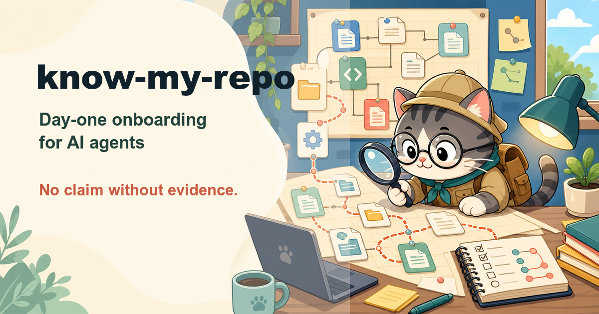

# know-my-repo

**Day-one onboarding for AI agents — from zero knowledge to a cited,
verified understanding of your repository.**

`know-my-repo` is an [agent skill](https://vercel.com/docs/agent-resources/skills)
for the moment an agent meets a codebase it has never seen: no CLAUDE.md, no
architecture docs, no notes. Instead of guessing from file names and
training-data vibes, the agent earns its understanding — by reading the
code, running the commands, and citing every claim — then writes the initial
knowledge set so no future session starts from zero again.

## What it does

```
/know-my-repo .
```

1. **Recon** — detects the stack; if substantial knowledge files already
   exist it stops and recommends [clean-slate](https://github.com/silkyland/clean-slate)
   instead of writing competing docs.
2. **Deep read** — five parallel exploration scopes: structure & entry
   points, data flow (write AND read path), wiring, tests & CI, git
   trajectory. Every component classified works / half-wired / dead with a
   proving file path.
3. **Convention extraction** — the repo's actual patterns, each proven by
   **2+ examples and no counterexample**; conflicting patterns are reported
   as inconsistencies, never silently resolved.
4. **Command verification** — build/test/lint found in manifests and CI,
   then actually run (safe ones only). A failing test suite is a first-class
   finding, not a secret.
5. **Exemplar trace** — one real, recently-touched feature followed end to
   end (route → handler → service → storage → output). This becomes "How to
   add a feature here": the repo's own pattern, proven by its own code.
6. **Write** — `AGENTS.md` (under 150 lines, behavior-changing lines only)
   and `docs/ARCHITECTURE.md` (component map, data flow, exemplar trace,
   inconsistencies). Every fact cited; the unverifiable tagged `UNVERIFIED`.
7. **Cold-start test** — re-reads only the generated docs as a fresh agent:
   can it find where things live, run the tests, add a feature? Gaps get
   fixed before presenting.
8. **Report** — findings, sharp edges, inconsistencies for the team to
   settle, and half-wired components worth a deep-plan run.

Nothing is deleted — this skill only creates.

## The skill family

| Skill | Moment |
|-------|--------|
| **know-my-repo** | Day one: agent meets a repo with no knowledge files |
| [deep-plan](https://github.com/silkyland/deep-plan) | Planning the next feature/refactor — evidence-gated, 7 phases |
| [deep-plan-ingest](https://github.com/silkyland/deep-plan) | After a plan: distill it into the living knowledge files |
| [clean-slate](https://github.com/silkyland/clean-slate) | The day the knowledge files rot: backup-gated reset |

Shared law: **no claim without evidence.** A convention needs two examples;
a command needs a real run; a fact needs a `file:line`.

## Install

```bash
npx skills add silkyland/know-my-repo
```

Or copy this directory into your agent's skills folder
(e.g. `~/.claude/skills/know-my-repo/`).

## Structure

```
know-my-repo/
├── SKILL.md                          # 8-step workflow + evidence rules
└── references/
    ├── exploration-guide.md          # The 5 parallel scopes + classification
    ├── conventions-guide.md          # 2+ examples rule, dimensions, counterexample checks
    └── knowledge-templates.md        # AGENTS.md / ARCHITECTURE.md structures
```

Follows the [Vercel skills](https://github.com/vercel-labs/skills) single-skill
layout and [Anthropic's skill authoring best practices](https://platform.claude.com/docs/en/agents-and-tools/agent-skills/best-practices).

## License

MIT
